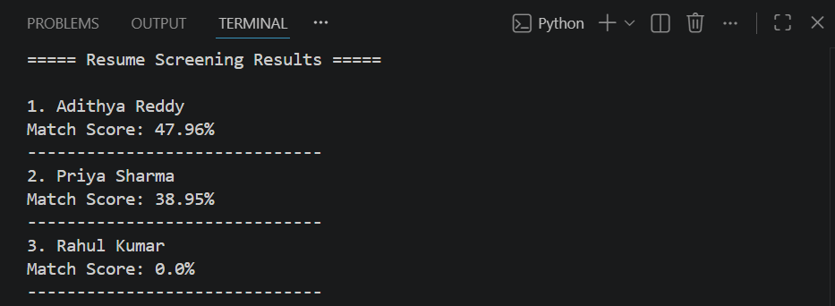

AI Resume Screening System

Overview:
AI Resume Screening System is a Python-based web application that helps recruiters analyze and rank resumes automatically. The system extracts text from uploaded PDF resumes and compares them with a job description using Natural Language Processing (NLP) techniques.

Features:
- Upload multiple PDF resumes
- Extract text from PDF files
- Match resumes against a job description
- Calculate similarity scores using TF-IDF and Cosine Similarity
- Rank candidates automatically
- Export screening results to CSV
- User-friendly web interface using Flask

Technologies Used:
- Python
- Flask
- Scikit-Learn
- Pandas
- PyPDF2
- HTML
- CSS
- Git & GitHub

Installation:
1. Clone the repository

git clone https://github.com/Adhi28726/AI-Resume-Screening-System.git

2. Move to project directory

cd AI-Resume-Screening-System

3. Install required packages

pip install flask pandas scikit-learn PyPDF2

4. Run the application

python app.py

5. Open browser

http://127.0.0.1:5000

How It Works:
1. User uploads PDF resumes.
2. The system extracts text from each resume.
3. The job description is converted into numerical vectors.
4. TF-IDF Vectorization and Cosine Similarity are used to calculate match scores.
5. Candidates are ranked based on their scores.
6. Results are displayed and exported to CSV.

Future Enhancements:
- ATS Score Calculation
- Skill Extraction
- Resume Keyword Analysis
- Candidate Dashboard
- Job Description Upload
- AI-Based Resume Feedback
- Database Integration

License:
This project is developed for educational and portfolio purposes.

Output:

